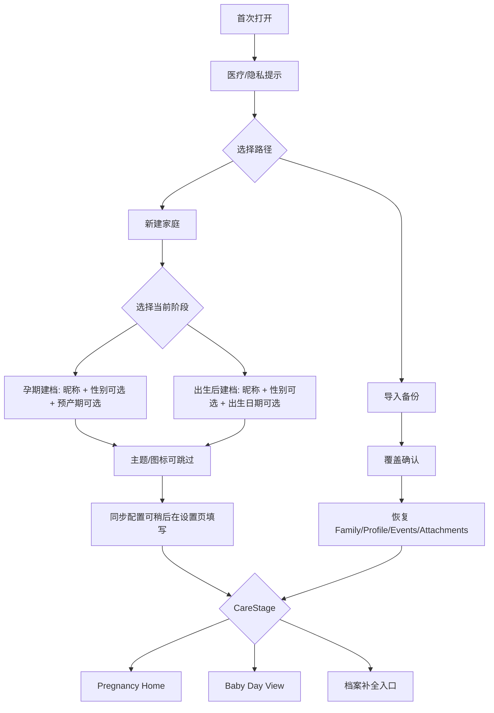

# BabyLog 阶段主线重构计划

## Status

| 项目 | 内容 |
|---|---|
| 文档状态 | Review Ready |
| 日期 | 2026-05-15 |
| 目标读者 | Claude / Codex / 项目维护者 |
| 适用范围 | Android 原生阶段一 MVP |
| 关联文档 | `docs/Piyo对标差异与BabyLog产品方向.md`、`docs/BabyLog重构前逻辑核查.md`、`共享模型简化-Claude.md`、`UI设计书.md`、`需求评估表.md` |

## Scope

本计划解决 BabyLog 当前首页和导航的信息架构问题。

BabyLog MUST 以“生命阶段主线”为用户界面主逻辑：

| 阶段 | 默认主界面 | 用户主要任务 |
|---|---|---|
| 孕期 `pregnancy` | 孕期首页 | 查看孕周、预产期、B 超/产检、孕期趋势 |
| 出生后 `baby` | 育儿日视图 | 按天记录喂养、睡眠、尿布、体温、用药 |
| 出生 `birth` | 阶段切换事件 | 从孕期主线切换到出生后主线 |

统一 `Event` 时间线 MUST 保留为数据层和历史视图。

统一 `Event` 时间线 MUST NOT 直接决定首页内容。首页必须先按当前阶段投影。

阶段投影落地前，App MUST 先提供首登建档或导入备份入口。没有可编辑的预产期、出生日期、阶段覆盖项和家庭空间，出生后日视图与家庭共享都无法验收。连接已有家庭 MUST 复用同步配置入口，通过服务器地址 + 家庭密钥完成，不放进首登主流程。

## Current Problem

当前 Android 首页同时暴露孕期内容和育儿内容：

| 位置 | 当前表现 | 问题 |
|---|---|---|
| 旧 `MainActivity.renderHome()` | 显示孕周卡后直接展示 `dashboard.recentEvents` | 孕期、B 超、喂养、体温混在同一首页主叙事 |
| 旧 `MainActivity.todayPanel()` | 显示今日记录、上次记录、待同步 | 孕期阶段也会被育儿式今日统计占据 |
| 旧 `MainActivity.quickActions()` | 同时提供喂养、睡眠、尿布、体温、用药、B 超 | 阶段无关，孕期和出生后入口混放 |
| 旧 `MainActivity.renderTimeline()` | `全部/孕期/育儿/B 超/体温/产检` 同级筛选 | 阶段和类型混为一层 |
| 设置页档案区域 | 预产期、当前范围等信息偏静态展示 | 缺少可编辑 `expectedDueDate` / `birthDate`，阶段切换不可测试 |

核心错误：把“数据层统一时间线”误用成“UI 层统一首页”。

## Evidence

| 来源 | 证据 |
|---|---|
| `docs/Piyo对标差异与BabyLog产品方向.md` | Piyo 主界面是“日期 + 时间轴 + 底部事件按钮”，BabyLog 应增加“孕期首页”和“育儿日视图”两种首页模式 |
| `diagnostics/app-compare/README.md` | Piyo 首登分为“启动 / 与伴侣分享 / 转移数据”；建档后还会选择主题、账户关联并进入记录主界面。BabyLog 只借鉴“同步可跳过”的流程，不接任何第三方账户 |
| `diagnostics/app-compare/piyolog-manual-screenshots/` | 手动截图显示完成注册摘要、主题选择、账户关联、摘要、成长曲线空态、菜单和设置。BabyLog 把账户关联替换为私有服务器身份校验 |
| `diagnostics/app-compare/piyolog-main-screen.png` | Piyo 记录页以当天 24 小时时间轴和底部高频按钮为核心 |
| `UI设计书.md` | “出生后呈现喂养/睡眠/尿布；孕期阶段展示最近产检” |
| `需求评估表.md` | `CORE-02` 阶段计算、`CORE-04` 统一时间线、`PREG-01` 孕期首页、`BIRTH-01` 出生记录均为 P0 |

## Product Decisions

| ID | 决策 | 规则 |
|---|---|---|
| D-1 | 数据层统一，界面层分阶段 | `Event` 统一存储；首页、快捷入口、趋势、摘要按阶段过滤 |
| D-2 | 孕期首页优先服务孕期 | 孕期首页 MUST NOT 默认展示喂养、尿布、睡眠统计 |
| D-3 | 出生后首页改为日视图 | 出生后首页 MUST 以日期和 24 小时时间轴为核心 |
| D-4 | 快捷入口跟随阶段 | 当前阶段无关的入口 MUST 隐藏到历史、资料或更多 |
| D-5 | 时间线是历史页 | 全部时间线 MAY 展示全量事件，但 MUST 作为历史/筛选视图，不作为默认首页 |
| D-6 | 出生是阶段切换事件 | 录入出生信息后，当前主界面 SHOULD 从孕期首页切换到育儿日视图 |
| D-7 | 首登建档和档案编辑是 Phase 1 前置 | 首登 MUST 能新建家庭或导入备份；设置页 MUST 能编辑预产期、出生日期、阶段覆盖项 |
| D-8 | `ChildProfile` 是阶段真相源 | `birth` 事件是记录载体；保存出生记录时回写 `ChildProfile.birthDate`；`CareStage` 只从 `ChildProfile` 推导 |
| D-9 | 阶段切换必须可人工覆盖 | 用户 MUST 能把阶段固定为 `pregnancy` 或 `unknown`，避免日期自动切换造成不合适的出生后 UI |
| D-10 | 日界必须集中处理 | 日视图和日摘要 MUST 通过单一 day-bucket helper 归属日期，第一轮默认 00:00，预留 04:00 配置口 |
| D-11 | Round 2 功能地基不回退 | colors/DayNight、unitInput、软范围、FileProvider、状态保存等功能性提交 MUST 保留 |
| D-12 | 档案必须参与备份恢复 | `ChildProfile` 一旦落库，导出、导入、清空、恢复 MUST 同步覆盖 profile |
| D-13 | 事件类型更新必须原子化 | 新增 `eventType` MUST 同步更新 `EVENT_TYPES`、summary、timeline group 和筛选映射 |
| D-14 | 导入是破坏性操作 | 当前导入会覆盖本机数据；UI MUST 在执行前二次确认 |
| D-15 | 写入不得阻塞主线程 | 记录保存、导入、清空、档案更新 SHOULD 在后台 IO 执行 |
| D-16 | 医疗/成长数值不得造假 | 首页趋势无真实数据时 MUST 显示空态，MUST NOT 用硬编码假数值兜底 |
| D-17 | 附件文件名必须稳定唯一 | 私有附件文件名 SHOULD 包含 UUID、attachmentId 或等价唯一字段 |
| D-18 | 首登先分流再建档 | 新装 MUST 提供“新建家庭 / 导入备份”两条路，不能直接进入混合首页 |
| D-19 | 建档是阶段分支 | 新建家庭 MUST 先选择孕期或出生后，再录入对应日期字段 |
| D-20 | 日期可后补但状态要诚实 | 预产期、出生日期、性别 MAY 后补；缺失时 MUST 显示补全入口和对应空态，不得硬编码默认值 |
| D-21 | 家庭共享服务固定熟人 | 共享只服务本人、配偶、父母、最多一名月嫂；MUST NOT 做邀请码、二维码、第三方鉴权；设备靠“服务器地址 + 家庭密钥”加入 |
| D-22 | 角色是客户端软约束 | 角色固定为 `manager`、`family`、`caregiver`；只约束 5 个敏感动作；服务端强制 RBAC 后置 |
| D-23 | 成长曲线依赖档案完整度 | 缺性别或出生日期时，成长曲线 MUST 显示明确空态，而不是空图或假数据 |

## Terms

| 术语 | 含义 |
|---|---|
| CareStage | 当前宝宝所处阶段：`pregnancy`、`baby`、`unknown` |
| Pregnancy Home | 孕期默认首页 |
| Baby Day View | 出生后默认日视图，类似 Piyo 的记录工作台 |
| Unified Timeline | 全量事件历史视图，不等于首页 |
| Stage Projection | 从统一事件中按阶段筛选出当前界面需要展示的内容 |
| Stage Override | 用户手动指定的阶段覆盖项，用于暂停或纠正自动阶段推导 |
| Day Bucket | 将事件归属到某个记录日的日期计算规则 |
| Family | 一个家庭数据空间；本机模式也必须创建默认 Family |
| Family Member | 家庭成员或照护者，带角色和权限 |
| Family Key | 家庭密钥；设备知道服务器地址和家庭密钥即视为可加入该私有家庭 |
| Role | 成员权限：manager、family、caregiver |

## Target Flow

### First Run Flow

全新安装、清空本机数据、或导入后没有 profile 时，App MUST 进入首登分流，而不是直接渲染首页。

### Main App Flow

| 场景 | 主路径 | 规则 |
|---|---|---|
| 孕期使用 | 首登建档或设置补档案 -> 孕期首页 -> B 超/产检/胎动/宫缩/孕妈体重 | 最近记录只展示孕期事件；待复核 B 超应优先露出 |
| 出生后使用 | 录入出生信息或选择出生后建档 -> 育儿日视图 -> 高频记录栏 | 主视图按选定日期显示喂养、睡眠、尿布、体温、用药等 |
| 回看孕期资料 | 出生后 -> 资料库或历史时间线 -> 孕期筛选 | B 超和产检资料必须可达 |
| 家属加入 | 设置/同步 -> 服务器地址 + 家庭密钥 -> 同一 Family 和 ChildProfile | 不重复建档；按角色限制能力 |
| 月嫂短期照护 | manager 配置 caregiver -> 当天记录；离开后软停用或轮换家庭密钥 | 不允许导出、清空、改档案、管理成员、查看完整历史医疗 |
| 档案缺失 | 任意入口发现关键字段缺失 -> 显示补全 CTA | 不用硬编码日期、假曲线或假趋势填补 |

### Navigation Flow

| 入口 | 必须可达内容 |
|---|---|
| 首页 | 当前阶段主任务：孕期首页或育儿日视图 |
| 底部/快捷栏 | 当前阶段高频记录 |
| 历史时间线 | 全量事件，支持阶段筛选和类型筛选 |
| 资料库 | B 超、产检、出生证明、疫苗本等，默认优先当前阶段但不隐藏历史 |
| 摘要/趋势 | 当前阶段统计；缺档案或缺数据时显示空态 |
| 菜单/设置 | 档案编辑、家庭共享、导出/导入、隐私说明、同步设置、显示设置 |

## Requirements

### R-0 首登建档和档案编辑

| 要求 | 规则 |
|---|---|
| R-0.1 | 全新安装或清空本机数据后，App MUST 先显示首登分流页，MUST NOT 直接进入首页 |
| R-0.2 | 首登分流页 MUST 提供两条路径：新建家庭、导入备份 |
| R-0.3 | 新建家庭 MUST 先创建默认 `Family`，并显示医疗/隐私/本机数据提示 |
| R-0.4 | 新建家庭 MUST 选择阶段：孕期 `pregnancy` 或出生后 `baby` |
| R-0.5 | 孕期建档 MUST 支持乳名/昵称、性别可选、预产期可选 |
| R-0.6 | 出生后建档 MUST 支持乳名/昵称、性别可选、出生日期可选 |
| R-0.7 | 预产期、出生日期、性别 MAY 后补；缺失时 MUST 持久化“缺失”状态并显示补全入口 |
| R-0.8 | App MUST 在设置页提供档案编辑入口，可修改昵称、性别、预产期、出生日期、阶段覆盖 |
| R-0.9 | 阶段覆盖 `stageOverride` 取值为自动、孕期、出生后、未知 |
| R-0.10 | 主题、图标、连接已有家庭和同步配置 MAY 在首登后提示或跳过，不得阻塞本机记录 |

### R-1 阶段模型

| 要求 | 规则 |
|---|---|
| R-1.1 | App MUST 能计算当前 `CareStage` |
| R-1.2 | `stageOverride` 不为空时，阶段 MUST 先服从人工覆盖 |
| R-1.3 | 无人工覆盖，且有出生日期、当前日期不早于出生日期时，阶段 MUST 为 `baby` |
| R-1.4 | 无人工覆盖，未出生但有预产期时，阶段 MUST 为 `pregnancy` |
| R-1.5 | 阶段未知时，App SHOULD 显示档案补全入口，不应展示混合首页 |
| R-1.6 | 没有真实 `birthDate` 时，App MUST NOT 自动展示庆祝式育儿 UI；`birth` 事件可作为补充记录，不是阶段推导真相源 |

### R-2 孕期首页

孕期首页 MUST 包含：

| 区域 | 内容 |
|---|---|
| 阶段头图 | 孕周、预产期、距预产期天数 |
| 孕期摘要 | 最近 B 超、最近产检、待复核项 |
| 孕期趋势 | EFW / BPD / HC / AC / FL 中已有数据 |
| 孕期快捷入口 | B 超、产检、胎动、宫缩、孕妈体重 |
| 最近孕期记录 | 仅展示孕期事件；不展示出生后育儿事件 |

孕期首页 MUST NOT 默认展示：

| 内容 | 原因 |
|---|---|
| 喂养统计 | 出生后场景 |
| 尿布统计 | 出生后场景 |
| 睡眠统计 | 出生后场景 |
| 育儿日视图底部事件栏 | 出生后工作流 |

### R-3 出生后育儿日视图

出生后首页 MUST 包含：

| 区域 | 内容 |
|---|---|
| 日期导航 | 今天、前一天、后一天、日期选择 |
| 宝宝状态 | 昵称、日龄/月龄 |
| 第一轮日列表 | 按选定日期显示出生后事件，可先用倒序列表 |
| Phase 2 时间轴 | 24 小时刻度竖轴，按当天时间显示事件 |
| 高频记录栏 | 母乳、奶瓶、睡眠、起床、尿尿、便便 |
| 辅助入口 | 体温、用药、成长、日记 |
| 日摘要入口 | 喂养次数、奶量、睡眠时长、尿布次数 |

第一轮 MUST 完成日期切换、选定日期事件列表、底部快捷栏。Piyo 式像素级 24 小时刻度竖轴 SHOULD 放到 Phase 2。

出生后首页 MUST NOT 默认展示：

| 内容 | 处理方式 |
|---|---|
| B 超作为主卡片 | 移入资料库或历史时间线 |
| 产检作为主入口 | 移入资料库或历史时间线 |
| 孕周大卡 | 改为宝宝日龄/月龄 |

### R-4 快捷入口分流

| 阶段 | P0 快捷入口 |
|---|---|
| `pregnancy` | B 超、产检、胎动、宫缩、孕妈体重 |
| `baby` | 母乳、奶瓶、睡眠、起床、尿尿、便便、体温、用药 |
| `unknown` | 补全档案、导入备份 |

快捷入口函数 SHOULD 从 `quickActions()` 改为 `quickActionsForStage(CareStage stage)`。

### R-5 时间线历史页

时间线页 MUST 支持两层筛选：

| 层级 | 筛选项 |
|---|---|
| 阶段 | 全部、孕期、出生后 |
| 类型 | 按阶段动态展示类型，例如孕期显示 B 超/产检，出生后显示喂养/睡眠/尿布 |

“孕期”筛选 MUST 包含 B 超、产检、胎动、宫缩、出生前孕妈指标。

“出生后”筛选 MUST 包含喂养、睡眠、尿布、体温、用药、成长、疫苗、日记。

`note` 事件 MUST 在 payload 中保存创建时的阶段。时间线默认可在两个阶段显示 note，但阶段筛选时 SHOULD 优先显示同阶段 note。

### R-6 日界和日期归属

| 要求 | 规则 |
|---|---|
| R-6.1 | App MUST 提供单一 helper 计算事件所属记录日 |
| R-6.2 | 第一轮默认日界 MUST 为 00:00 |
| R-6.3 | helper MUST 预留 04:00 日界配置口 |
| R-6.4 | 日视图和日摘要 MUST 使用同一个 day-bucket helper |

### R-7 资料和趋势联动

| 阶段 | 趋势默认项 | 资料默认项 |
|---|---|---|
| `pregnancy` | EFW、BPD、HC、AC、FL | B 超单、检查单、产检资料 |
| `baby` | 体重、身长/身高、头围 | 出生证明、疫苗本、儿保资料 |

资料库 MAY 展示全阶段资料，但默认排序 SHOULD 优先当前阶段。

出生后阶段 MUST 仍可访问孕期 B 超和产检资料。医疗记录不得因阶段切换被隐藏到不可达。

### R-8 数据安全和逻辑门禁

| 要求 | 规则 |
|---|---|
| R-8.1 | `FamilyProfile`、`ChildProfile` 和本机当前成员 MUST 支持本机保存、备份导出、备份导入和清空 |
| R-8.2 | `summarizeToday()` MUST 对未知或新事件类型安全，不得因 `counts.get()` 为空崩溃 |
| R-8.3 | 导入备份 MUST 在读取并覆盖本机数据前显示二次确认 |
| R-8.4 | 保存记录、导入备份、清空本机数据、档案编辑 SHOULD 不在 UI 线程执行全量 JSON 读写 |
| R-8.5 | 首页趋势卡 MUST 只展示真实记录；无 B 超或体重数据时显示空态 |
| R-8.6 | 附件保存和恢复 SHOULD 使用稳定唯一文件名，不能只依赖毫秒时间戳 |
| R-8.7 | 数字输入 MUST 拒绝 `NaN`、`Infinity` 等非有限值 |
| R-8.8 | backup schema SHOULD 升版支持 profile，并 MUST 兼容旧备份缺 profile 的情况 |

### R-9 家庭共享入口和角色

BabyLog 的目标使用者是一个真实家庭：爸爸、妈妈、爷爷奶奶，以及可能短期参与的月嫂。共享模型 SHOULD 先服务这个私有小范围场景。

| 要求 | 规则 |
|---|---|
| R-9.1 | 连接已有家庭 MUST 复用同步配置 UI，填写服务器地址 + 家庭密钥 |
| R-9.2 | 连接已有家庭的设备 MUST 拉取或恢复已有 `Family`、`ChildProfile` 和事件，MUST NOT 创建第二份宝宝档案 |
| R-9.3 | 后端未配置时，“连接已有家庭”入口 MUST 明确显示暂不可用，并提供导入备份作为本机兜底 |
| R-9.4 | 阶段一 MUST NOT 引入邀请码、二维码、FamilyInvite、手机号验证码、第三方登录或 session provider |
| R-9.5 | 家庭成员 MUST 有 3 个角色：manager、family、caregiver |
| R-9.6 | 角色权限 MUST 是客户端软约束，只管 5 个敏感动作：清空本地、全量导出、改服务器配置、改关键档案、管成员 |
| R-9.7 | caregiver 默认只能读写当天 day-bucket；不得导出、清空、改档案、管成员或查看完整历史医疗 |
| R-9.8 | 所有可同步记录 MUST 带 `familyId`、`childId`、`createdByMemberId`，编辑时 SHOULD 带 `updatedByMemberId` |
| R-9.9 | 启用同步或连接远端家庭前，MUST 显示跨设备/医疗数据确认 |
| R-9.10 | 月嫂硬隔离 MUST 依赖家庭密钥轮换或本机 `status=stopped`；服务端强制 RBAC 后置 |

| Role | 典型成员 | P0 权限 |
|---|---|---|
| manager | 本人、配偶 | 全部读写、档案、导出、清空、服务器配置、成员管理 |
| family | 爷爷奶奶等家属 | 查看和日常记录；默认不允许清空、全量导出、改服务器配置、改关键档案、管成员 |
| caregiver | 月嫂/短期照护者 | 当天记录和当天查看；不允许导出、查看完整历史医疗、清空、改档案、管理成员 |

## Data Model

### Required Minimal Additions

| Field | Type | Required | Rule |
|---|---|---|---|
| `FamilyProfile.id` | string UUID | Required | 本机模式也创建一个默认 family，作为备份和未来同步边界 |
| `FamilyProfile.name` | string | Optional | 默认可用“我的家庭” |
| `ChildProfile.id` | string UUID | Required | 一个 family 下第一轮只支持一个宝宝 |
| `ChildProfile.familyId` | string UUID | Required | 指向所属 `FamilyProfile` |
| `ChildProfile.nickname` | string | Recommended | 首登乳名/昵称；允许后补，但 UI 应提示补全 |
| `ChildProfile.sex` | enum | Optional | `male`、`female`、`unknown`；成长曲线依赖此字段 |
| `ChildProfile.stageOverride` | enum | Required | 默认 `auto`；可设 `pregnancy`、`baby`、`unknown` |
| `ChildProfile.expectedDueDate` | string date | Optional | 孕期阶段用于孕周和预产期计算；未填时显示补全入口 |
| `ChildProfile.birthDate` | string date | Optional | 出生后阶段用于日龄/月龄和成长曲线；未填时显示补全入口 |
| `ChildProfile.setupCompleted` | boolean | Required | 控制是否已完成首登分流；导入旧备份时可由 profile 是否存在推断 |
| `FamilyMember.id` | string UUID | Required for sync | 本机 manager 默认创建；同步后用于署名和权限 |
| `FamilyMember.role` | enum | Required for sync | `manager`、`family`、`caregiver` |
| `FamilyMember.displayName` | string | Optional | 家属设备显示名称 |
| `FamilyMember.status` | enum | Required for sync | `active`、`stopped`；stopped 保留历史署名但不可继续写入 |
| `Event.stage` | enum or derived | Optional | 可由 `eventType` 推导，MVP 可不落库 |
| `Event.payload.stage` | enum | Required for `note` | note 创建时保存当前阶段 |

MVP SHOULD 先用 `eventType` 推导事件阶段，避免立即迁移全部数据。首登选择的阶段 MAY 暂存为 `stageOverride`；当用户后续补齐预产期或出生日期后，UI SHOULD 引导回到 `auto`。

`ChildProfile.birthDate` MUST 是出生后自动阶段判断的单一真相源。`birth` 事件 MUST 作为可回看的记录载体；保存 `birth` 事件时 MUST 同步回写 `ChildProfile.birthDate`，并记录出生体重、身长、头围等 payload。

`FamilyProfile`、`ChildProfile` 和本机当前成员 MUST 纳入备份 schema。导入备份时，profile 恢复 MUST 与 events、attachments、syncChanges 同一事务语义完成；导入失败时不得留下半恢复阶段状态。

### Event Type Stage Mapping

| eventType | Stage |
|---|---|
| `pregnancy_checkup` | `pregnancy` |
| `ultrasound` | `pregnancy` |
| `fetal_movement` | `pregnancy` |
| `contraction` | `pregnancy` |
| `birth` | `birth` |
| `feed` / `breastfeed` / `bottle` | `baby` |
| `sleep` / `wake` | `baby` |
| `diaper` / `pee` / `poop` | `baby` |
| `temperature` | `baby` |
| `medication` | `baby` |
| `growth` | `baby` |
| `vaccine` | `baby` |
| `note` | payload stage；默认可在 all 中显示 |

## Implementation Plan

Phase 2-5 的阶段投影 UI MUST 在 `ComposeMainActivity.kt` 实现。`MainActivity.java` 的手写 Java View 已不再作为实现载体；逻辑层继续复用 `BabyLogDomain`、`BabyLogService`、`BabyLogRepository`、`BabyLogFormatters`、`BabyLogFileProvider`、`BabyLogImageUtils`。

### Phase 0：冻结当前 UI 实验

| 步骤 | 要求 |
|---|---|
| 0.1 | MUST 检查当前工作树，分离未提交 UI 实验、Compose 实验和截图文件 |
| 0.2 | MUST 确认 `diagnostics/` 和 `android-ui-*.png` 不会入库 |
| 0.3 | MUST 在 git status 干净，或明确分 stage 后，才能进入 Phase 1 |
| 0.4 | MUST 决定保留哪些视觉 token，避免把产品重构和视觉实验混入一个 commit |
| 0.5 | MUST 保留 Round 2 功能地基：colors/DayNight、unitInput、软范围、FileProvider、状态保存 |

### Phase 1：首登建档 + 档案编辑 + 阶段模型

| 步骤 | 文件 | 要求 |
|---|---|---|
| 1.1 | `BabyLogDomain.java` | 明确 `FamilyProfile`、`ChildProfile`、本机 manager member 的最小字段 |
| 1.2 | `BabyLogRepository.java` | 保存和读取本机 Family、ChildProfile、当前成员 |
| 1.3 | `ComposeMainActivity.kt` | 新增首登分流：新建家庭、导入备份 |
| 1.4 | `ComposeMainActivity.kt` | 新建家庭分支：孕期建档、出生后建档、日期可跳过但必须落缺失状态 |
| 1.5 | `ComposeMainActivity.kt` | 设置页增加档案编辑入口，可修改昵称、性别、预产期、出生日期、阶段覆盖 |
| 1.6 | `ComposeMainActivity.kt` | 设置/同步入口支持连接已有家庭；后端未配置时显示不可用说明和导入备份兜底 |
| 1.7 | `BabyLogFormatters.java` 或新 helper | 新增 `CareStage` 推导函数 |
| 1.8 | `BabyLogFormatters.java` 或新 helper | 新增 day-bucket helper，默认 00:00，预留 04:00 |
| 1.9 | smoke tests | 覆盖预产期、出生日期、人工 override、未知阶段、day-bucket |
| 1.10 | manual QA | 能通过首登或设置页填写 `birthDate` 并触达出生后日视图 |
| 1.11 | `BabyLogRepository.java` / `BabyLogService.java` | Family、ChildProfile、当前成员保存后 MUST 参与备份导出、导入恢复、清空；backup schema SHOULD 升版并兼容旧备份 |
| 1.12 | `BabyLogService.java` | `summarizeToday()` 改为未知类型安全计数 |
| 1.13 | `ComposeMainActivity.kt` | 导入备份前增加覆盖本机数据二次确认 |
| 1.14 | `ComposeMainActivity.kt` / service 写路径 | 保存、导入、清空、档案写入 SHOULD 进入后台 IO |
| 1.15 | tests / manual QA | 导出 profile -> 清空 -> 导入后，家庭、宝宝、阶段和日期必须恢复 |

### Phase 2：首页分流

| 步骤 | 文件 | 要求 |
|---|---|---|
| 2.1 | `ComposeMainActivity.kt` | 首页按 `CareStage` 分派到孕期首页 / 出生后日视图 |
| 2.2 | `ComposeMainActivity.kt` | 孕期首页只展示孕期数据 |
| 2.3 | `ComposeMainActivity.kt` | 出生后首页建立日视图骨架 |
| 2.4 | tests / manual QA | 验证两个阶段首屏内容互不污染 |
| 2.5 | `ComposeMainActivity.kt` / service query | 移除 EFW、孕妈体重假数据兜底，改为真实最近记录或空态 |

### Phase 3：快捷入口分流

| 步骤 | 文件 | 要求 |
|---|---|---|
| 3.1 | `ComposeMainActivity.kt` | `quickActions()` 改为阶段化入口 |
| 3.2 | `BabyLogDomain.java` / `BabyLogService.java` / `BabyLogFormatters.java` | 必要时拆分母乳、奶瓶、尿尿、便便事件；新增类型必须同步 EVENT_TYPES、summary、filter group |
| 3.3 | manual QA | 验证孕期不显示育儿入口，出生后不显示孕期主入口 |

### Phase 4：时间线降级为历史页

| 步骤 | 文件 | 要求 |
|---|---|---|
| 4.1 | `BabyLogFormatters.java` | 增加 `eventStage()` 和阶段筛选 |
| 4.2 | `ComposeMainActivity.kt` | 时间线筛选改为阶段层 + 类型层 |
| 4.3 | manual QA | 验证孕期筛选包含 B 超，出生后筛选包含育儿事件 |

### Phase 5：趋势和资料阶段化

| 步骤 | 文件 | 要求 |
|---|---|---|
| 5.1 | `ComposeMainActivity.kt` | 首页趋势卡按阶段切换 |
| 5.2 | `ComposeMainActivity.kt` | 资料库默认优先当前阶段 |
| 5.3 | docs | 更新 UI 设计书或追加变更说明 |

### Phase 6：家庭共享 MVP（私有场景）

| 步骤 | 文件 | 要求 |
|---|---|---|
| 6.1 | docs / service contract | 定义 PocketBase 集合契约：family、child、event、attachment、member；阶段一只做家庭密钥校验 |
| 6.2 | `BabyLogDomain.java` | 补齐极简 `FamilyMember` 和客户端软角色判断：manager/family/caregiver |
| 6.3 | `ComposeMainActivity.kt` | 设置页/同步页支持填写服务器地址 + 家庭密钥来连接已有家庭 |
| 6.4 | `ComposeMainActivity.kt` | 连接成功后拉取同一 `Family` / `ChildProfile`，禁止进入新建宝宝流程 |
| 6.5 | sync service | push/pull events + attachments；所有同步记录带 familyId、childId、createdByMemberId/updatedByMemberId |
| 6.6 | sync service | 冲突处理先按 last-write-wins by `updatedAt`，不引入 vector clock |
| 6.7 | manual QA | 两台设备验证：A 建档，B 用地址 + 家庭密钥连接后看到同一宝宝档案和同一日视图 |
| 6.8 | manual QA | caregiver 软停用或家庭密钥轮换后，不能继续新增记录、查看完整历史医疗或导出资料 |

## Acceptance Criteria

| ID | 验收标准 |
|---|---|
| AC-1 | 孕期阶段首页首屏不出现喂养、睡眠、尿布统计 |
| AC-2 | 出生后阶段首页首屏是日期 + 日视图，不出现孕周大卡 |
| AC-3 | 孕期快捷入口不出现母乳、奶瓶、尿尿、便便 |
| AC-4 | 出生后快捷入口不默认出现 B 超、产检 |
| AC-5 | 全部时间线仍可查看所有事件 |
| AC-6 | 时间线“孕期”筛选包含 B 超和产检 |
| AC-7 | 时间线“出生后”筛选包含喂养、睡眠、尿布、体温、用药 |
| AC-8 | B 超、附件、备份、同步队列能力不因首页重构回退 |
| AC-9 | setup 未完成或导入旧备份缺 profile 时，显示首登分流或档案补全入口，不出现破碎混合首页 |
| AC-10 | 设置页可编辑预产期、出生日期、阶段覆盖，并能触发首页阶段变化 |
| AC-11 | `birth` 事件保存后回写 `ChildProfile.birthDate`，`CareStage` 只从 `ChildProfile` 推导 |
| AC-12 | 日视图和日摘要使用同一个 day-bucket helper |
| AC-13 | 人工 override 为 `pregnancy` 或 `unknown` 时，不自动展示出生后育儿日视图 |
| AC-14 | 编辑 profile 后导出、清空、导入，预产期、出生日期、阶段覆盖必须恢复 |
| AC-15 | 导入包含未知 eventType 的备份，dashboard 不崩溃 |
| AC-16 | 导入备份前出现覆盖本机数据确认；取消后本机记录不变 |
| AC-17 | 新增 `breastfeed` / `bottle` / `wake` / `pee` / `poop` 任一事件类型时，summary 和时间线筛选不崩溃 |
| AC-18 | 首页没有 B 超或孕妈体重记录时显示空态，不显示 `1320 g`、`28+3 周`、`60.4 kg` 等假数据 |
| AC-19 | 保存快捷记录和 B 超时，UI 不因全量 JSON 写入阻塞主线程 |
| AC-20 | 附件恢复后，每个 attachment 指向独立可读文件；同批恢复不得互相覆盖 |
| AC-21 | 全新安装首屏出现新建家庭、导入备份，不出现混合首页 |
| AC-22 | 新建孕期家庭后，首页进入孕期主线；未填预产期时显示补全入口，不使用硬编码日期 |
| AC-23 | 新建出生后家庭后，首页进入育儿日视图；未填出生日期时显示日龄缺失提示和补全入口 |
| AC-24 | 成长曲线在缺性别或出生日期时显示明确空态，不显示空图或假曲线 |
| AC-25 | 设置页可回改昵称、性别、预产期、出生日期、阶段覆盖，保存后首页立即按新阶段投影 |
| AC-26 | 设置页用服务器地址 + 家庭密钥连接已有家庭时，不会创建第二份宝宝档案；连接成功后使用远端或备份中的同一 `familyId` / `childId` |
| AC-27 | 后端未配置时，连接已有家庭和同步入口明确不可用，不引导用户以为已经开启服务器共享 |
| AC-28 | 菜单/设置能触达档案、家庭共享、搜索记录、导出、设置等核心路径 |
| AC-29 | caregiver 角色不能导出、清空、改档案、管成员或查看完整历史医疗 |
| AC-30 | App 不出现 Google/Apple/微信等第三方账户登录入口；服务器接入后也只做家庭身份校验和同步授权 |

## Claude Review Checklist

请 Claude 重点评审以下问题：

| 问题 | 期望结论 |
|---|---|
| 阶段模型是否足以防止孕期/育儿内容混放 | 必须能防止 |
| 孕期首页是否应保留最近记录 | 可以保留，但必须只保留孕期记录 |
| 出生后是否必须第一轮做完整 24h 时间轴 | 可先做骨架，但导航和入口必须先切对 |
| B 超在出生后应放哪里 | 默认放资料库和历史时间线，不作为主入口 |
| 时间线是否还需要“全部” | 需要，但必须是历史视图，不是首页 |
| 当前 UI 美化改动是否应保留 | 纯视觉 polish 推迟；Round 2 功能地基必须保留 |
| 首登建档和档案编辑是否足以验收阶段切换 | 必须能录入和编辑 expectedDueDate、birthDate、stageOverride |
| 丧失或暂停场景是否被尊重 | 必须允许人工 override 到 pregnancy/unknown |
| L-1/L-2/L-3 是否已进入 Phase 1 | 必须作为重构硬门禁 |
| 假趋势数据是否已移除 | 必须改为真实记录或空态 |
| 首登建档是否足以避免 unknown 首页 | 必须覆盖新建孕期、新建出生后、导入备份；连接已有家庭放到设置/同步入口 |
| 家庭共享模型是否适合自家使用 | 必须覆盖爸爸妈妈、父母、月嫂，并能限制临时照护者权限 |
| 连接已有家庭是否会造成重复宝宝档案 | 必须不会；连接后使用同一 family/child |
| 日期缺失是否仍能诚实运行 | 必须可用但显示补全入口，不造假 |
| Piyo 截图里的关键流程是否已吸收 | 首登分流、建档、主题可跳过、身份校验可跳过、主记录工作台、成长曲线空态、菜单/设置入口 |

## Logic Self-Check

| 检查项 | 结论 |
|---|---|
| 数据层统一时间线与 UI 分阶段是否冲突 | 不冲突。`Event` 仍是统一存储；首页、快捷入口、摘要和趋势必须走 Stage Projection |
| 首登建档与阶段推导是否闭环 | 闭环。首登必须创建 `Family` / `ChildProfile`，阶段由 `stageOverride`、`birthDate`、`expectedDueDate` 推导 |
| 日期可跳过是否会造成假数据 | 不会。缺预产期、出生日期或性别时必须显示补全入口或空态，禁止硬编码假日期、假趋势、假成长曲线 |
| 出生事件和出生日期是否双数据源 | 不允许双真相源。`birth` 事件是记录载体；自动阶段判断只读 `ChildProfile.birthDate` |
| 连接已有家庭是否会重复建档 | 不会。连接已有家庭必须复用远端或备份中的 `familyId` / `childId`，禁止进入新建宝宝流程 |
| 家庭共享是否被第三方账户带偏 | 不会。Google/Apple/微信等第三方登录是 Non-Goal；服务器只做家庭成员和设备身份校验 |
| 月嫂/临时照护者是否权限过大 | 不应过大。`caregiver` 默认只允许当天记录和当天查看，支持软停用和家庭密钥轮换失效 |
| 导入备份是否会破坏阶段状态 | Phase 1 必须修复。Family、ChildProfile、当前成员必须进入 backup schema，并在导入前二次确认 |
| 新事件类型是否会引发 dashboard 崩溃 | Phase 1 必须修复。summary 和 filter 必须对未知类型安全，新类型映射必须原子更新 |
| 日视图是否会因凌晨记录返工 | 不应返工。所有日期归属必须走 day-bucket helper，第一轮 00:00，预留 04:00 |
| Round 2 UI 功能地基是否会被误删 | 不应误删。FileProvider、状态保存、软范围、unitInput、DayNight token 明确保留 |
| 仍后置的内容是否阻塞 Phase 1-5 | 不阻塞。完整 24h 像素时间轴、Room 迁移、真实服务器共享、视觉精修均后置 |

## Non-Goals

| 项目 | 说明 |
|---|---|
| 不重写整个项目 | 本地数据、附件、B 超、备份、同步队列继续复用；本轮只把 View 层迁到 Compose，逻辑层复用 |
| 不立即迁移 Room | 数据库迁移属于 D 类数据层任务 |
| 不做第三方账户体系 | 不接 Google、Apple、微信、广告、订阅、公开注册；家庭共享先走自家私有邀请 + 简单服务器身份校验 |
| 不复刻 Piyo 视觉 | 只借鉴工作流，不复制粉色视觉风格 |
| 不在同一 commit 做大规模 UI polish | 先修产品主线，再做视觉精修 |
| 不做营销式 4 页 onboarding | 首登只做新建家庭、导入备份和必要医疗/隐私确认 |
| 不做多家庭运营 | 第一轮只支持一个家庭、一个宝宝；多宝宝、多家庭后置 |
| 不回退已完成功能地基 | FileProvider、状态保存、软范围、unitInput、DayNight token 不属于可回退 polish |

## Risk Controls

| 风险 | 控制规则 |
|---|---|
| 再次把所有内容放回首页 | 每个首页模块必须声明所属阶段 |
| 快捷入口继续混放 | `quickActionsForStage()` 必须成为唯一入口来源 |
| 时间线筛选语义混乱 | 阶段筛选和类型筛选必须分层 |
| 重构破坏已有功能 | 每个 phase 后必须跑 debug build 和至少一次真机 smoke |
| 当前工作树污染提交 | 文档、产品重构、UI 实验必须分 commit |
| 重构验收死锁 | Phase 1 必须先落首登建档和档案编辑，确保出生后日视图可触达 |
| 双数据源漂移 | `CareStage` 只从 `ChildProfile` 推导，`birth` 事件保存时回写 profile |
| 丧失场景体验事故 | 没有真实出生信息或人工 override 时，禁止自动切换到庆祝式育儿 UI |
| 日视图返工 | day-bucket helper 必须先于日视图实现 |
| 误冻结功能地基 | Phase 0 必须明确 Round 2 功能性提交不回退 |
| 导入恢复丢档案 | profile schema 必须与 backup/import 同步落地 |
| 新事件类型导致崩溃 | summary 和 filter 必须对未知类型安全 |
| 导入静默覆盖 | 导入前必须显示覆盖确认，并建议先导出 |
| 假医疗/成长数据破坏信任 | 趋势卡只能展示真实数据或空态 |
| 写入随数据增长卡顿 | 写路径后台化，Room 迁移作为后续数据层任务 |
| 首登分支又回到混合首页 | setup 未完成时只能显示首登分流或补全入口，不渲染主首页 |
| 家属设备重复建档 | 连接已有家庭成功后必须复用远端 `Family` / `ChildProfile`，禁止走新建宝宝路径 |
| 月嫂权限过大 | caregiver 权限默认最小化，并支持软停用和家庭密钥轮换失效 |
| 共享未配置却显示可用 | 后端未配置时连接已有家庭和同步按钮必须禁用，并给出本机/导入备份路径 |
| 缺日期导致假成长曲线 | 成长曲线和日龄/月龄必须读 profile；缺字段显示空态和补全入口 |
